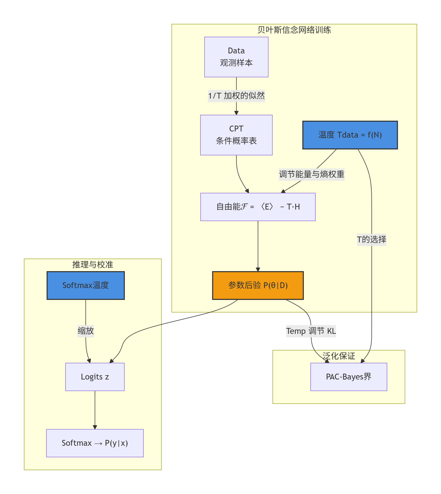
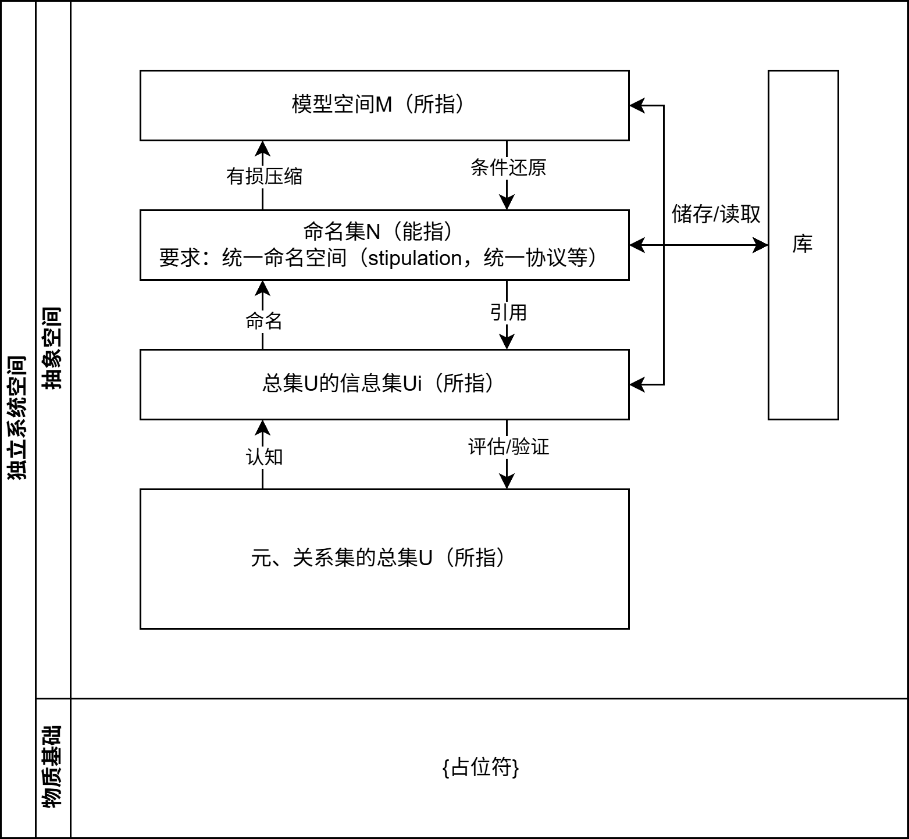

# RCT系统工程执行总纲领

**
注意，本文尚处于持续更新起草阶段，包含大量不成熟的表述和思想，且有内容参考AI联合检索引擎的资料撰写；请注意甄别和批判！其中画删除线的部分，均为标注的待审核&维护部分！**

$$
\mathbb{P = NP~~~?}
$$

## ReConciousTy系统世界观

本文关于系统工程体系的讨论，需要且必要从世界观的概念开始。
本文对于世界观的定义为：意识体（conciousty）对于自身与世界关系的总观念。
其中意识体的定义为：建立在与世界交互基础上，能通过任意方法论过程、输出认识的个体。
ReConciousTy系统世界观认为世界观由四个部分组成：

其中：
本体论Ontology讨论世界的本源、物质&存在的本质，属于认识论的公理环境；
认识论epistemology讨论认知的过程、知识&信念的本质与局限性，属于方法论的公理环境；
价值观values讨论意识体的目的，间接影响方法论的实现形式；
方法论methodology讨论意识体与客观世界交互的系统框架（也是本文的核心部分）。

*本文中，以下ReConciousTy均简写为RCT。
RCT是中文“意识体重构”的翻译，之所以提出这个概念，是因为笔者出于乐观的猜想，认为意识的程序&硬件化是可以实现的，也就是说：意识将并非一直是人脑特有的机能。
RCT的目的是模拟和结构化意识体对世界的认识&交互过程，以致于能得到一个（或由数个组合而成的整体）强形式系统。（ReConciousTy体系强形式系统）因此，RCT必然受第一不完备定理制约。需要强调，RCT的强形式系统并不意味着它一定是硬系统工程；恰恰相反，传统硬系统工程中的定量工具，在此只是可选工具手段的一种，是否选用取决于对所建立系统空间的认识。

<del>

表述约定：

强与弱的表述:

|学科领域范例|弱定义|强定义|
|---|---|---|
|广义特征|宽松，允许例外或广义解释|严格，要求精确满足条件|
||复杂、不完整或开放性问题|结构清晰、边界明确的问题|
|数学|弱解（积分形式）|强解（逐点满足微分方程）|
|计算机科学|JavaScript类型系统|Rust类型系统|
|逻辑学|包容性定义（如“存在先于本质”）|排他性定义（如“二元对立”）|

</del>

### 本体论

RCT系统工程世界观中，本体论阶段主要规定存在的子类划分、以及这些子类之间关系。

<del>

存在概念对应的基本问题是：“有什么？（What is here?）”
RCT系统工程世界观定义：存在的概念为一切实在、或可能实在的事物，最基础（高阶）的属性。
对于存在的子类划分、以及这些子类之间关系的规定，决定一个世界观中本体论属于“唯物”、“唯心”还是“二元论”派别；RCT系统工程世界观从属于唯物派别，认为物质、意识等是存在的子类，且物质是第一性的（其他存在均为物质的派生）。
对存在的定义以及物质第一性的判断，组成“世界唯物公理”的内容。

宇宙三公理

|公理|分理一|分理二|
|---|---|---|
|时间T|无尽：$t∈(-∞,+∞)$|永前：△t>0|
|空间U|无界：$r∈[0,+∞)$|永在：r=ct|
|质量M|无限：$m∈(0,+∞)$|永在：dρ_η≠dρ_0|

- 世界唯物公理
- 永恒运动公理
- 普遍联系公理

关键定义：
约定物质元的运动对其他元的影响，称为“关系（联系）”。
约定性质是关系的共相的涌现（隐含实在论观点：性质是存在所拥有的，包含特征、属性、品质、方面、型向等种种在内，决定其他存在是何种样子的特殊独立客观存在；而这种独立客观存在又称为“共相Universal”）。

涌现作用分为弱涌现和强涌现

永恒运动公理原本被归为唯物辩证法（方法论）中的内容，RCT系统工程世界观认为这样分类不够准确、将永恒运动公理的内容类别明确到了本体论中。
需要注意，这三条公理并不直接包含守恒公理。

需要注意，对于有什么问题的研究与回答，依赖于物理学对世界本源的前沿研究。三条公理实际上是对当前物理研究的简要提炼，当涉及更具体的内容，譬如存在形式等等，又需要更进一步的定义和解释。

认识论闭环：
RCT认识论部分对于知识本质的定义是一种信念，那么必然需要给出三大公理的信念基础。RCT本质唯物，所以这种信念基础必然是实践（实验）基础。
1.唯物：纯粹信念
2.联系：四种基本力 & 场论 & 纠缠现象
3.运动：基于观测的宇宙学信念

</del>

### RCT系统认识论&信息论

在RCT系统工程世界观对认识的定义是：为存在命名、并研究存在的结构。
认识论阶段主要描述如何为存在命名、并研究其结构，即描述如何“认识”；以及认识何种条件下成为“知识”。
即：什么是“是”，以及“是什么”的问题。
其中，是什么的问题有着更广泛的外延，绝大部分内容应当属于垂直领域的具体科学内容。在RCT认识论部分，我们仅集中于研究一些大前提性质的问题。
认识研究活动的行动包括但不限于：猜测、判断、描述&定义。而对存在结构的研究极其重要的一部分，便是对存在性质的研究。

RCT认识论认为：
认识的获取源于意识体与存在的互动，由存在的实践到经验，再到对经验的信念；如此循环往复、不断迭代。
其中存在的实践为客观的部分，而经验以及对经验的信念则是主观的部分。

知识在传统知识论中被定义为“合理的真实信念”（justified true belief）(JTB理论)，是某种可以用贝叶斯信念网络获取的存在；但从葛梯尔反例以及上文对认识的描述，我们可以判断并非仅仅如此，知识应当是被视为一个涉及认知主体、认知过程与外部世界之间复杂互动，经过高度迭代的有机整体。
借鉴当代的分类，认识的运动过程应当是：先天知识——后天知识——后天知识迭代；其中按类型又分为行为能力知识（knowing-how），和命题性知识（knowing-that）。
科学理论中的定义便是一种先天命题性知识。

<del>

主义，RCT认识论之于理性主义，更偏向经验主义；认为理性的“先验知识”本身来源是经历复杂迭代验证的结构经验。因而，在RCT系统工程世界观中，经验是一切主观认识的起点，同时也是一个及其重要的“回归枢纽”。（回归枢纽的解释：经验通过判断成为信念，信念经历验证将回归经验；用于指导实践的必须是经验，而非信念。因为首代信念是未迭代、未验证的。）

对于存在性质的判断表述，即是“谓词（predicate）表述”。
对于存在性质的判断本质上是一种信念，当这种信念足够合理时、则称为知识。
当经验通过谓词表述时，便从纯粹的“经验”变成了“对该经验的一个信念”；从而具有了命题性质，开始有真假之分，而纯粹的经验并不具备命题性质。

RCT认识论定义：信念需要通过实践验证可靠性，产生新的经验来进行迭代，才是合法的。当然，我们承认有些信念难以通过实践进行验证，这些归属于“特殊情况”，但我们仍然认定它们是不合法的。

这里根据历史经验，对基本性质做一个参考归集；该归集的目的是：RCT系统认识论试图构建一个能完全使用基础性质，一步步无序或有序地、组合成任意性质的性质定义系统。最基础、不可再分的（具有原子性的）性质称为基础性质；而这些由基础性质组合而成的性质，称为高级性质。
需要强调的是，某些高级性质的组合过程，是有内在某类顺序的，例如时序、逻辑顺序等；有序组合与无序组合是两种完全不同的结构。

</del>

#### 概念探索&概念库

相对于现实世界中可能的外延变动，通常一个稳定的概念并不会发生内涵的变化。因此我们称一个稳定的概念指一组固定的内涵构成的集合，再通过语言的表述，使得概念得到“定义”（概念定义=属+种差）。这也是“定义”的定义，我们也可以称之为“分类”。

从信息论的角度来看，“定义”的概念探索行为便是一种原始的、通常有损的信息压缩，这一观察将为之后概念探索程序化开辟初始的道路。

需要强调，这种概念的稳定是“人为需要的”，因为概念本身在形成时常常具备缺陷，其内涵集常常是发展的。但在特定的阶段内，人为固定其定义表述有助于意识体记载和使用它。（定义的时效性和版本记录）

不同的意识个体对于同一概念的统一认识，我们称为“共识”，共识是交流和协作的基础，通过统一定义的形式得以高效运行；换言之，若一个概念在系统的运行中要保证作用，所有涉及的意识个体都需要对其具有一定的“共识”。

但有时“共识”不一定以统一定义的标准形式存在。广泛的，我们能见到“好像有这么一个概念，但说不清是什么，或者每个人对他的表述都不太一样”这样的情况存在，这时虽然对该概念的语言定义并不统一，系统却仍能运行。谚语有云“知其然而不知其所以然”，但这时在系统中，每个人对其外延的把握都是多少有数的（至少保证在把握的外延内正常运行的），所以系统仍然能正常运作。我们称这种状态的概念统一认识状态为“伪共识”。

当共识的积累达到一定程度，以至于超出了单一意识个体所能承载的上限时，便需要一个外部库来对共识的内容进行保存，这便是（外部）概念库，如Wiki。库是一个工程概念，我们将会遇到、构建多种不同的库，这一部分将在工程实践的部分正式展开叙述。

#### 信息翻译&信息表达

信息翻译与表达是语言的工作。

#### 信息传递&对接协议

我们可以认为语言某种角度也承担信息传递的工作，但本体系特意将语言与信息传递的概念拆开叙述，专指基于物理层面的传递、以及基于此涉及的抽象结构，以更清晰地展示这些子概念。

信息的传递也需要具备物质的载体，这种载体的本质多种多样，可以是纸张与墨水，也可以是由现代电子硬件和程序软件共同构筑而成的信息工具，更可以是一些更原始的物质。

例如在概率空间中，信息的传递可以用贝叶斯概率进行信息的传递更新和计算。

需要强调，贝叶斯概率表达式$p(\mathcal{A}|\mathcal{B})$包括两种本质不同的问题：条件概率问题与似然概率问题，需要着重注意。

<del>
待消化编辑内容：

**关键词清单**：

- **贝叶斯信念网络** / **Bayesian belief network**（概率图模型）
- **温度参数** / **temperature parameter**（控制分布陡峭度的超参数）
- **后验分布** / **posterior distribution**（由似然和先验通过贝叶斯定理得到）
- **冷后验效应** / **cold posterior effect**（T<1 改善预测的现象）
- **似然函数** / **likelihood**（被温度指数调整的数据拟合项）
- **KL‑散度** / **KL divergence**（优化目标中的正则项）

**关键词定义**：

- **贝叶斯信念网络（Bayesian Belief Network, BBN）**：一种有向无环图（DAG）模型，描述随机变量之间的条件依赖关系。由网络 **结构**（有向无环图）与 **参数**（每个节点在其父节点取值下的条件概率分布，CPT）两部分组成。在参数学习中，常采用最大似然（ML）方法，但当样本量较小时容易过拟合；完全贝叶斯方法虽能缓解该问题，但超参数选择困难，这时“数据温度”（data temperature）等替代估计方法便提供了新的思路。

- **温度参数（temperature parameter）**：最初来自统计力学，表示系统能量的起伏程度。在贝叶斯推断中，温度 通过指数方式改变似然函数的权重：
  
  $$
  p(\theta|\mathcal{D}) \propto p(\mathcal{D}|\theta)^{1/T}\,p(\theta).
  $$

  当 时（“冷后验”），似然被强化，后验更集中；当 时（“暖后验”），似然被弱化，后验更分散。

**隐含关键词**（问题中未出现但与材料强关联）：

- **最小自由能（Minimum Free Energy, MFE）**：源于热力学，用于 BBN 参数学习。温度作为自由能泛函中的乘子，平衡“能量”（数据拟合）与“熵”（模型复杂度）。
- **数据温度（Data Temperature）**：一种显式的反温度建模，设为可用数据量的单调递增函数，使得有限样本下的似然评价更合理。
- **逆温度（inverse‑temperature）**：，常出现在玻尔兹曼分布或能量基模型中。
- **Softmax 温度**：在分类网络的输出层，温度 对 logits 缩放，平滑或锐化类别概率，与冷后验效应的机理互补。
- **PAC‑贝叶斯（PAC‑Bayes）**：提供泛化误差界，温度通过调节先验‑后验的 KL 散度影响界的松紧。
- **模型误设（model misspecification）**：CPE 常被归因于模型误设，温度调谐实际上是选择一组与更合理似然、先验对应的后验。

**材料来源**（按主题分类）：

- 贝叶斯信念网络定义与参数学习：〖0†L46-L47〗 → 包含结构与 CPT；〖7†L5-L11〗 → 说明 ML 参数学习的困难；〖7†L11-L15〗 → 提出最小自由能方法。
- 温度参数定义与冷后验效应：〖1†L15-L20〗 → 给出温度引理；〖2†L29-L32〗 → 详述 T<1 与 T>1 的效果；〖6†L12-L23〗 → 进一步与 PAC‑贝叶斯关联。
- 数据温度：〖7†L16-L19〗 → 数据温度假设；〖7†L33-L35〗 → 温度作为数据量的单调函数；〖16†L4-L9〗 → 参考文献 [21]。
- Softmax 温度：〖3†L8-L9〗 → 温度缩放的基本操作；〖9†L13-L20〗 → 具体算例；〖8†L17-L20〗 → 在贝叶斯神经网络中的校准应用。
- Cold posterior effect 与模型误设：〖6†L25-L30〗 → CPE 与欠拟合的关系；〖11†L18-L20〗 → 温度调谐相当于选择不同后验；〖10†L3-L8〗 → 系统性的温度优化方法。

**问题主题与目的**：本题旨在系统理解“温度参数”在贝叶斯信念网络中的多重角色，包括后验调节、参数学习（数据温度）、预测校准（softmax 温度）以及泛化控制（PAC‑Bayes）。基于材料，可以梳理出以下主流方案思路。

**主流方案思路**（基于上述材料提炼，非直接拼构原文）：

- **后验调节视角**：在后验公式中显式引入 ，通过交叉验证或边际似然选择最优温度，以平衡数据拟合与先验正则化。
- **信息论/自由能视角**：把温度视为自由能泛函中的 Lagrange 乘子，利用“数据温度”随样本量自适应变化，实现小样本下的参数学习。
- **校准视角**：在贝叶斯信念网络用于分类时，对输出的条件概率引入 Softmax 温度，通过验证集优化校准曲线（Expected Calibration Error），提升概率置信度。
- **泛化视角**：在 PAC‑贝叶斯框架下，温度直接出现在泛化界中，通过调节后验与先验的 KL 散度，权衡经验误差与模型复杂度。

详细模型解析

温度参数如何嵌入贝叶斯信念网络

贝叶斯信念网络（BBN）是一个有向无环图，其联合分布由每个节点在父节点条件下的条件概率表（CPT）乘积给出：

$$
P(X_1,\dots,X_n) = \prod_{i=1}^{n} P(X_i \mid \text{Pa}(X_i)).
$$

在给定观测数据后，网络参数的后验分布为：

$$
P(\theta \mid \mathcal{D}) = \frac{P(\mathcal{D} \mid \theta)\,P(\theta)}{P(\mathcal{D})}.
$$

温度参数通过如下方式引入似然函数：

$$
P(\theta \mid \mathcal{D}) \propto \big[P(\mathcal{D} \mid \theta)\big]^{1/T}\,P(\theta).
$$

当 \(T<1\) 时，似然被强化，称为“冷后验”；当 \(T>1\) 时，似然被弱化，称为“暖后验”。

用指数形式重写后验，可得等价表达：

$$
P(\theta \mid \mathcal{D}) \propto \exp\left(\frac{1}{T}\log P(\mathcal{D} \mid \theta)\right) P(\theta).
$$

这表明温度的作用与统计力学中的 Boltzmann 分布一致：能量对应为负对数似然 \(-\log P(\mathcal{D} \mid \theta)\)，温度调节该能量对后验的影响程度。

使用温度的另一常见形式是将其应用到对数似然上，即定义一个能量函数 ，然后在模型推断中通过最小化自由能来学习参数。这对应文献中讨论的学学习和冷后验效应。

### 参数学习的“数据温度”

Isozaki 等人（2009）为贝叶斯信念网络的参数学习提出了“数据温度”的概念。在最小自由能（MFE）框架下，温度不再是人工设定的超参数，而是可用数据量 的函数：

$$
\beta_0 = f(N),\quad \text{满足 } \beta_0 \to \infty \text{ 当 } N \to \infty;\ \beta_0 \to 0 \text{ 当 } N \to 0.
$$

此时，目标函数（自由能）可写为：

$$
\mathcal{F}(\theta) = \langle E(\theta) \rangle - \beta_0^{-1} H(\theta),
$$

其中能量项衡量模型拟合，熵项控制复杂性。温度随样本量增大而趋近无穷（即 趋近于 0），从而自动从以熵为主过渡到以能量为主。

这种处理将概率波动视为虚拟的热波动，为小样本学习提供了坚实的物理意义。

### Softmax 温度与预测校准

当贝叶斯信念网络用于多类分类时，输出节点的条件概率分布常使用 Softmax 函数生成：

$$
P(y=k \mid \mathbf{x}) = \frac{\exp(z_k / T)}{\sum_{j} \exp(z_j / T)},
$$

其中 \(z_k\) 是 logits（例如来自父节点加权和）。温度 \(T\) 控制分布的平滑程度：

- \(T>1\)：概率分布更平滑，熵增大，避免过早陷入局部最优；
- \(T<1\)：分布更尖锐，置信度更高，但可能过拟合。

在贝叶斯深度学习中，温度缩放常用于校准网络输出的概率，使之与实际正确率匹配。这可以看作对模型置信度的不确定性建模，与冷后验效应互为补充。

### PAC‑贝叶斯视角下的温度

在泛化理论中，PAC‑贝叶斯界的形式为：

$$
\mathbb{E}_{\theta\sim Q}\left[\mathcal{L}(\theta)\right] \le \mathbb{E}_{\theta\sim Q}\left[\widehat{\mathcal{L}}(\theta)\right] + \frac{KL(Q\|P) + \log\frac{1}{\delta}}{2n}.
$$

温度参数隐含在后验与先验的相对熵中，因为后验实际为 。通过调节温度，可以控制 KL 散度的大小，从而在经验风险和泛化误差之间取得最佳平衡。

## 🔧 结构图

下图用 **Mermaid.js** 绘制了以温度参数为中心的模型结构，展示其在不同模块中的角色。

**图例说明**：
- **温度参数**（两个蓝色节点）贯穿训练、推理和泛化三个层面。
- 在训练阶段，“数据温度”影响自由能泛函，从而调节后验的集中程度。
- 在推理阶段，“Softmax 温度”控制输出概率的平滑度，直接影响决策置信度。
- 在泛化层面，温度通过 KL 散度的变化影响 PAC‑Bayes 泛化界。

</del>

#### 系统辩证还原论

从概念定义的定义出发，我们给“分类”一个更加明细的操作性的定义：

- 在某一系统空间中，将内涵单元通过线性方式分为两类、产生新自由度的操作，称为一次“分类”；当不提及分类次数时，“分类”通指所有分类操作。

这样定义的目的是将概念定义转化为“可在先验指导下的线性可分问题”；其中，先验指导隐含在系统空间与空间变换中。

### 价值观

价值观本质是“何处去”的问题。
RCT系统工程世界观认为，价值观通过影响方法论的判断，最终影响信念以及迭代经验；故在进入方法部分前，有必要澄清价值观的问题。

RCT系统工程世界观不对既定的先天价值观做相对严格的限制，但有明确的反对路线如下：

1. 虚无主义

这一点将在建模方法论一节中首次提及，并再后续的章节中展开叙述。实际应用中，系统目标与核心价值观应当由实际应用者赋予；即RCT系统工程世界观不能提供任何价值方向上的引导。

<del>

另外需要强调RCT系统工程世界观当前存在的一个问题：RCT系统工程世界观不具有社会普适性（在不同的价值追求下，RCT系统工程世界观的方法论指导出的实践必然会产生冲突）；明明在系统的定义能够将社会的概念包含在内的前提下，却难以直接表现出社会普适性。
有线索表明这可能与RCT系统工程世界观的价值观设定有关，若能以一种多个主观个体角度混合的非一致价值观系统、来组合RCT系统工程世界观其他部分，或能解决此问题。（我当时想表达什么？似乎是在考虑若实践中考虑伦理等价值冲突时，RCT是否还具有通用性？即传统硬系统工程受到的有关弱社会伦理意识的批判）

</del>

<del>

### 系统辩证法

**
系统辩证法内容需要完全重写！

首先给出本文中“系统辩证法（Systematic Dialectics）”的定义：系统辩证法是以系统化价值（即“有限可重复性”），为目的导向的辩证法。
上文中“有限可重复性”的定义：有限可重复性指，包括以资料记载目的在内，在一定条件下（即“有限”，以下“有限”一词均指代此意）可以被重复实现的性质。其中仅能存在于记载中而无法再现的情况，又被标记为“过时的”。

本文讨论的方法论自称为RCT系统辩证法，属于系统辩证法的一种；它由传统辩证法总结而来，以实现“有限可重复性”和更高效率为价值观。

RCT系统辩证法包括三条公理：

- 归纳逻辑公理
- 演绎逻辑公理
- 结构化公理

归纳逻辑公理本质（内涵）为关于普遍联系的论述。实际现象（外延）常表现为遍历法（计算机科学）、大范围试错等形式。
演绎逻辑公理本质（内涵）为由矛盾对立统一角度出发的论述、以及辩证否定的论述。实际现象（外延）常表现为普遍质疑法（即：对普遍事物永不停止的追问、质疑和反思）等形式。
结构化公理的部分本质（内涵）为质量互变的论述。本文认为，结构化是一个增加“封装解释维度”的过程、本质上是为了以更少的载体用于承载或解释更多信息。在信息交流的过程中，若交流双方均能理解相应的结构化载体（系统），将能大大提升交流速率；若有任何一方不能理解相应的结构化载体，则反而会大大增加交流难度、甚至常直接导致交流失败。例如，RCT系统工程世界观便是一个结构化载体，一个系统。

</del>

## RCT系统工程建模方法论

在《系统工程引论》中提到，一般意义的系统结构，可以用以下通式来表示：

$$
S = \{E, R\}
$$

即：系统是建立在所含元素（要素）的集合$E$，以及基于集合E的各类关系的集合R上的总集，记为集合$S$。

结合实践的经验，引论提到：不同系统的元素集E组成可以大相径庭，但对于关系集$R$，从系统工程的角度出发能给出一个基本一致的分类：

$$
R = R_1 \cup R_2 \cup R_3 \cup R_4
$$

其中：

- $R_1$对应元素与元素、局部（元素集子集）与局部之间的关系（横向）
- $R_2$对应元素与子集、元素集整体之间的层次关系（纵向）
- $R_3$对应系统$S$与环境之间的关系
- $R_4$对应其他的限制关系

这种分类基本描述了绝大多数系统的情况，但尚不够对系统进行更深层次的挖掘。这里便提出RCT体系系统工程的根本任务，对横向与纵向关系进行维度拓展性的模型化解读。

严格来说，RCT体系属于主要基于传统硬系统方法论的改良，或者是一次统一软、硬系统方法论两者的尝试。

它旨在通过一些更详实的指导和范式规划，来减弱人的主观因素在传统硬系统方法论的不利局限性影响。但详实与精简冲突，范式与灵活冲突，是RCT本身固有的内在矛盾；RCT所要追求的是在这些冲突间寻找一个良好的平衡点，或是为使用者提供寻找平衡点的优良方法；以达到压缩学习和使用信息成本的目的。

### 系统建模方法的抽象结构

首先给出RCT系统工程建模方法论的基本假设：

- 假设1：方法论的使用必然存在认知主体（意识体）的参与；
- 假设2：在同一涌现层级内，一切事物均可以被表示为元、元之间关系所共同构成的集合；
- 假设3：任何自由度（维度）的概念，均是从元与关系的集合中，通过某种独立性分化方式涌现得到的（弱涌现）；
- 假设4：不同涌现层级之间，均可以被表示为以层级元、涌现性质关系元共同构成的集合；

给出一些关键的基本定义：

- 约定在同一涌现层级中，一个元不可再分时，称为该层级上的“单位元”。
- 约定在同一涌现层级中，自由度数据服从标准高斯分布时，称该自由度“独立”[自由度独立](#independance-of-dimension)。
- 约定在同一涌现层级中，自由度之间的相互独立形成的空间，称为该层级上的“系统空间”。

给出一些关键的工程基本定义：

- 约定我们描述（构造）一个系统空间用于特定目的（即便未清晰定义）时，称为“工程系统空间”。
- 约定一个工程系统空间（通常是简化的）中，任意处理过程的单位元称呼为“模块”。
- 约定各模块之间，必须规定输入输出的“传输协议标准”（stipulation），以保证输入输出合乎各模块自身的参数要求。
- 约定传输协议标准规定一个自由度（参数）空间，它是所有连接的输入输出所要求参数、以及追加要求参数（可能来自间接相连的模块，如成本要求等）的并集$P$所构成的空间；当参数要求作变换时，变换的算子也是该集合$P$的元。

- **性质的定义：**约定在所定义的系统空间内，这样一组特定约束条件，用于筛选得到一个：由部分元与元间关系，组合而成的有特殊意义的集合的；称为“性质”（特征）。（注：这个事物是否可以称为此空间内的子空间？需要进一步讨论！）
- 变换的定义
- 约定在所定义的空间内，所有绝对有效（安全）的、无前提无可置疑的简单变换，称为“基本变换”（safe/basic transformations）
- 约定在所定义的空间内，所有有一定意义（引发某种性质变化的）、但并非总是有效的变换，称为“启发式变换”（"heuristics"/heuristic transformations）

需要强调：自由度空间与维度正交空间两种不同的概念，工程上通常使用正交化来将自由度空间转化成维度正交空间，以符合几何认知直觉、便于工程处理。认为，一个系统空间是否存在正交基的标准型，是该系统空间迈向泛化的一大关键节点。

基于此，我们可以给出基于物质基础之上的一种通用抽象建模结构：

对图中名词的所指做出一些详细注释：

图中的“信息”包涵：“信息”、“情报”、“资料”等一类事物。信息的运动在工程实践中主要参考情报学的内容，并受传统学科中信息论、认知科学等多学科的指导。

什么是库？库是一种预置且相对固定（通常我们不希望它在结构上发生频繁的变动）的数据结构以及其所存储的内容构成的系统空间，用于快速的存取所需的信息。库所需参考的材料：图论、代数结构、数据结构。

此图描述了在系统建模的方法中；元、元之间关系所共同构成的总集U，是如何一步步通过可能不同的路径和方法，涌现成为模型，并与模型再一同涌现组成系统的抽象空间的。系统空间的涌现过程在此层级之上还要更为复杂。同时，此框架亦能解释为何传统学科不能找到一个普适的分类标准；可以认为其从物质基础、总集U开始，到形成的系统空间之间的交集均存在各种程度的变异，以至于难以形成传统意义上清晰的分类边界。

此外从中隐晦地推测，系统的目的蕴含在评估与验证当中，也就是说目的（价值）不是先天就有的，而是系统与系统运动中逐渐产生的，这也可能是为什么70年代旧式硬系统工程受到“回避目标定义”批判的根本原因。但在如今绝大多数工作都可以继承先前经验（信息）的前提下，我们在规划新系统时便可以提前进行目标的定义，其方法将在随后的章节进行讨论。

关于自由度独立性质的定义依据补充：

<del>

**缺少大量待补充内容：**

以下罗列一些实践的方法案例，作为参考索引：

假设2实践方法：（信息认知结构：图论与网络科学）任何由离散个体及其互动构成的系统（如社交网络、代谢网络、互联网）在数学上均被建模为图 $G=(V,E)$，其中 $V$为顶点集（元），E为边集（关系）。该表示在同一抽象层级内是完备的。（纽曼《网络：导论》）

命名集的实践原则：（索绪尔能指&所指；符号学/语言学）

假设3实践方法：（信息压缩/还原结构：拓扑流形（几何）、分类/回归算法）

总实践步骤：确定涌现层级（总集边界）；确定元与关系元（数据工程+特征工程）（数据集划分）；对元进行算法正交化分类或回归（或分类并回归）（模型开发/训练）；检验正交化形成的系统空间（测试集检验与评估）（部署后持续监控与维护）。

</del>

下面对这些具体实践方法的典例进行详细说明。

#### 集合结构

#### 维度涌现

#### 其他可能需要考虑的因素

<del>

可能的问题：离散/连续性、有序性等
模型的开发/训练方法：机器学习算法/深度学习/强化学习
学习的本质是信息的压缩（降维）与条件还原（升维）。
但升维的操作本身不止于此，升维也可用于解决线性不可分问题。

部分Justify：

整个工程应当遵守同一套工程协议规定（Stipulation），其内容例如MCP等。

为什么小模型是对的：目前来看，模型只能处理同一涌现层级内的问题，无法超层级处理。这需要一种跨层级处理的方式，目前较好的实践便是小模型互助会诊的模式。

数据工程应当包含输入输出类型的处理工程。

当整个层级内的工作均由一套整体方法完成，而监督者只考察输入输出时，称为“端到端的”，端到端的核心问题在于其黑箱性和相对不可控性。

面对元以及关系元的确定性变化，需要采取不同的工程模式：高确定性-数学分析，高不确定性-数理统计。这是由原始数据经验的迭代程度决定的，这种迭代的过程可能与贝叶斯方法强相关。

数学中，“空间”的严格定义通常指 一个集合配备某种附加结构（structure），这些结构定义了集合元素之间的关系、操作或性质。不同类型的空间对应不同的结构，其核心思想是通过公理化方法抽象出具体问题的本质特性，即：公理化（符合明确而固定的规则）、结构独立于集合元素、结构具备泛用性。

数据工程重要思想/工具
数据结构基本概念：
集合、群、环、域、非标准数学结构

数据结构基本工具：
线性代数

时序相关：
Takens定理（Takens’ law）（时间序列数据对动力系统特征基于嵌入相空间的还原）（数学分析动力系统建模）
经典时间序列分析（经典分解、自回归、状态空间、卡尔曼滤波）（数理统计）
动态系统建模（常微分方程ODE、偏微分方程PDE）（数学分析动力系统建模）
随机过程（马尔可夫链、泊松过程）（数理统计）
随机过程（随机微分方程SDE）（数学分析动力系统建模）
变换（傅里叶变换、小波变换）

特征工程重要思想/工具
数据降维方法：PCA分析/LDA/t-SNE/Autoencoder

</del>

## RCT系统控制论

